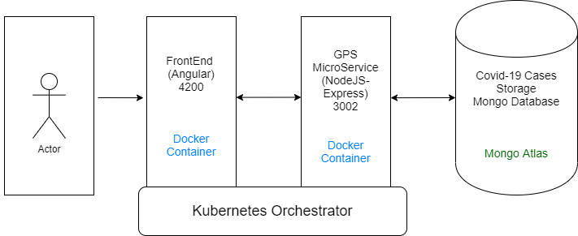

# TC3041 Proyecto Final Primavera 2020

# Covid-19DB
---

##### Integrantes:
1. *Daniel Charua* - *A01017419* - *CSF*
2. *Roberto Alejandro Gutiérrez Guillén* - *A01019608* - *CSF*
3. *Eduardo Badillo Álvarez* - *A01020716* - *CSF*
4. *Sergio Hernandez Castillo* - *A01025210* - *CSF*

---
## 1. Aspectos generales

Las orientaciones del proyecto se encuentran disponibles en la plataforma **Canvas**.

Este documento es una guía sobre qué información debe entregar como parte del proyecto, qué requerimientos técnicos debe cumplir y la estructura que debe seguir para organizar su entrega.

### 1.1 Requerimientos técnicos

A continuación se mencionan los requerimientos técnicos mínimos del proyecto, favor de tenerlos presente para que cumpla con todos.

* El equipo tiene la libertad de elegir las tecnologías de desarrollo a utilizar en el proyecto, sin embargo, debe tener presente que la solución final se deberá ejecutar en una plataforma en la nube. Puede ser  [Google Cloud Platform](https://cloud.google.com/?hl=es), [Azure](https://azure.microsoft.com/en-us/) o [AWS](https://aws.amazon.com/es/free/).
* El proyecto debe utilizar al menos dos modelos de bases de datos diferentes, de los estudiados en el curso.
* La solución debe utilizar una arquitectura de microservicios. Si no tiene conocimiento sobre este tema, le recomiendo la lectura [*Microservices*](https://martinfowler.com/articles/microservices.html) de [Martin Fowler](https://martinfowler.com).
* La arquitectura debe ser modular, escalable, con redundancia y alta disponibilidad.
* La arquitectura deberá estar separada claramente por capas (*frontend*, *backend*, *API RESTful*, datos y almacenamiento).
* Los diferentes componentes del proyecto (*frontend*, *backend*, *API RESTful*, bases de datos, entre otros) deberán ejecutarse sobre contenedores [Docker](https://www.docker.com/) y utilizar [Kubernetes](https://kubernetes.io/) como orquestador.
* Todo el código, *datasets* y la documentación del proyecto debe alojarse en este repositorio de GitHub siguiendo la estructura que aparece a continuación.

### 1.2 Estructura del repositorio
El proyecto debe seguir la siguiente estructura de carpetas:
```
- / 			        # Raíz de todo el proyecto
    - README.md			# Archivo con los datos del proyecto (este archivo)
    - frontend			# Carpeta con la solución del frontend (Web app)
    - backend			# Carpeta con la solución del backend (CMS)
    - api			# Carpeta con la solución de la API
    - datasets		        # Carpeta con los datasets y recursos utilizados (csv, json, audio, videos, entre otros)
    - dbs			# Carpeta con los modelos, catálogos y scripts necesarios para generar las bases de datos
    - docs			# Carpeta con la documentación del proyecto
        - stage_f               # Documentos de la entrega final
        - manuals               # Manuales y guías
```

### 1.3 Documentación  del proyecto

Como parte de la entrega final del proyecto, se debe incluir la siguiente información:

* Justificación de los modelo de *bases de datos* que seleccionaron.
* Descripción del o los *datasets* y las fuentes de información utilizadas.
* Guía de configuración, instalación y despliegue de la solución en la plataforma en la nube  seleccionada.
* Documentación de la API. Puede ver un ejemplo en [Swagger](https://swagger.io/). 
* El código debe estar documentado siguiendo los estándares definidos para el lenguaje de programación seleccionado.

## 2. Descripción del proyecto

Nuestro proyecto consiste en el desarrollo de una aplicación web para cargar datos, monitorear, analizar y registrar casos de la enfermedad por Coronavirus-2019. 

## 3. Solución

A continuación aparecen descritos los diferentes elementos que forman parte de la solución del proyecto.

### 3.1 Modelos de *bases de datos* utilizados

Los modelos de bases de datos utilizados son los siguientes:
   * MongoDB, una base de datos NoSQL basada en documentos, para registrar los casos de Covid-19. 
   
   Utilizamos MongoDB por la facilidad de uso del framework de agregación cuando se realizan consultas y por su servicio acccesible de 
   hosting de la base de datos en Mongo Atlas.
   
   *El JSON Schema de la base de datos se encuentra en el folder "database".*


El patrón de modelación de nuestra base de datos es referencial. Es decir, en vez de embeber subdocumentos como parte de una colección para denotar relación se guardan referencias en los documentos a documentos en otras colecciones. 

* La colección Cases guarda una relación referencial con Businesses 1:1 (Businesses._id)<->(Cases._id)
* La colección Cases guarda una relación referencial con Locations 1:1 (Cases._id)<->(Locations._id)
* La colección Cases guarda una relacion referencial con si misma 1:N Vector(closestFriends[])*->(Cases._id)
* La colección Businesses guarda una relación referencial con si misma 1:N Vector(suppliers[])*->(Businesses._id)
   
   * Redis, una base de datos NoSQL basada en el esquema llave-valor, para gestionar las sesiones de usuario en la aplicación.
  
   Utilizamos Redis por el manejo nativo de expiración de los registros, al ser automatizada la duración de sesión de los usuarios se    
   evita tener que desarrollar ese funcionamiento a nivel aplicación. 
   
### 3.2 Descripción de los datasets

El dataset fue producido en una aplicación de generación de datos JSON con el propósito de almacenar una cantidad realista de gente probada por coronavirus (aproximadamente diez millones de casos). 

Los campos del dataset son los siguientes:
* Nombre
* Apellidos
* Edad 
* Sexo
* Confirmado
* Coordenadas
* Lista de amigos
* Lista de amigos recientemente visitados

Para la generación de gráficas utilizamos una API que utiliza un repositorio oficial del conteo de cifras para poder desplegar datos fidedignos.

### 3.3 Arquitectura de la solución

Los dos modelos de bases de datos se están ejecutando en servidores externos, respectivamente Atlas y Redis-labs.

#### MongoDB


La base de datos de Mongo esta configurada como una arquitectura de desarrollo. Es decir, consiste de un solo replica set de 3 nodos y otro replica set de configuración. 

#### Redis


La base de datos de Redis está configurada como la arquitectura default de alta disponibilidad de Redis. Es decir, consiste de un cluster con un nodo maestro y nodos esclavos para proveer redundancia mediante replicación. 

### 3.4 Frontend

*[Incluya aquí una explicación de la solución utilizada para el frontend del proyecto. No olvide incluir las ligas o referencias donde se puede encontrar información de los lenguajes de programación, frameworks y librerías utilizadas.]*

#### 3.4.1 Lenguaje de programación
#### 3.4.2 Framework
#### 3.4.3 Librerías de funciones o dependencias

### 3.5 Backend

*[Incluya aquí una explicación de la solución utilizada para el backend del proyecto. No olvide incluir las ligas o referencias donde se puede encontrar información de los lenguajes de programación, frameworks y librerías utilizadas.]*

El backend esta ejecutandose en una VM dentro de AppEngine que sirve el contenido desde el puerto 3000, al recibir las solicitudes a su IP  ngix redirige el trafico al backend, este se conecta con el cluster de MongoAtlas y llama al frontend como contenido estático el cual esta almacenádo en un contenedor en Docker en GCP.

#### 3.5.1 Lenguaje de programación
#### 3.5.2 Framework
#### 3.5.3 Librerías de funciones o dependencias

### 3.6 API

*[Incluya aquí una explicación de la solución utilizada para implementar la API del proyecto. No olvide incluir las ligas o referencias donde se puede encontrar información de los lenguajes de programación, frameworks y librerías utilizadas.]*

#### 3.6.1 Lenguaje de programación
#### 3.6.2 Framework
#### 3.6.3 Librerías de funciones o dependencias

*[Incluya aquí una explicación de cada uno de los endpoints que forman parte de la API. Cada endpoint debe estar correctamente documentado.]*

*[Por cada endpoint debe incluir lo siguiente:]*

* **Descripción**:
* **URL**:
* **Verbos HTTP**:
* **Headers**:
* **Formato JSON del cuerpo de la solicitud**: 
* **Formato JSON de la respuesta**:
* **Códigos de error**:

## 3.7 Pasos a seguir para utilizar el proyecto

*[Incluya aquí una guía paso a paso para poder utilizar el proyecto, desde la clonación del repositorio hasta el despliegue de la solución en una plataforma en la nube.]*
Instalar
Bajar el git
Correr npm install en carpeta front-end
Correr npm install en microservices/auth

Correr el app
ng serve
Front end - Carpeta de front end
npm start run
API - Carpeta de APi
npm start
Auth Redis - Carpeta microservices/auth
npm start
Micro - Carpeta microservices/micro
## 4. Referencias

*[Incluya aquí las referencias a sitios de interés, datasets y cualquier otra información que haya utilizado para realizar el proyecto y que le puedan ser de utilidad a otras personas que quieran usarlo como referencia]*
